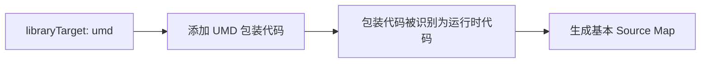
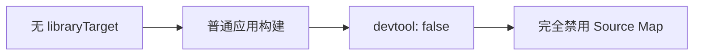
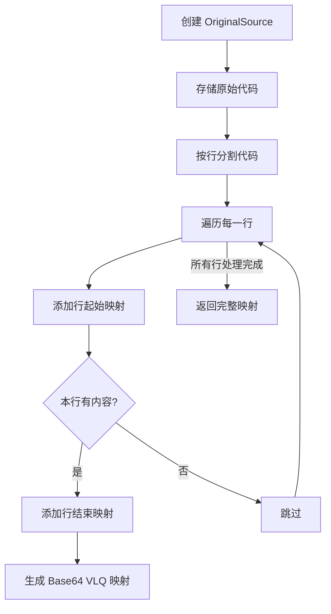

webpack config 设置了 libraryTarget:umd, 和 devtool: false
在 PROCESS_ASSETS_STAGE_DEV_TOOLING 阶段中对 asset 文件调用 sourceAndMap 方法，只有入口文件中会有 mappings ， 其他文件没有

# UMD 配置对 Source Map 的影响机制解析

## 核心差异原因

当配置 `libraryTarget: 'umd'` 时，Webpack 会将入口文件视为**库输出**而非普通应用，这会触发特殊的处理逻辑：

### 1. UMD 模式下的特殊行为


### 2. 非 UMD 模式下的行为


## 实现机制差异

### UMD 模式源码路径 (`lib/library/UmdLibraryPlugin.js`)

```javascript
class UmdLibraryPlugin {
  render(source, renderContext, libraryContext) {
    // 生成 UMD 包装代码
    return new ConcatSource(
      new OriginalSource( // ← 关键点：使用 OriginalSource
        `(function webpackUniversalModuleDefinition(root, factory) {...}`,
        "webpack/universalModuleDefinition"
      ),
      source,
      ";\n})"
    );
  }
}
```

### 关键差异点：`OriginalSource` 的使用

1. **UMD 模式使用 `OriginalSource`**:
   ```javascript
   new OriginalSource(..., "webpack/universalModuleDefinition")
   ```
   - 创建带有原始源代码信息的对象
   - 为 Source Map 生成提供基础

2. **普通模式使用 `RawSource`**:
   ```javascript
   // 普通模式运行时代码生成 (lib/RuntimeTemplate.js)
   generateRuntimeCode(chunk) {
     return new RawSource("(function(modules) {...}([...]);");
   }
   ```
   - `RawSource` 不包含源代码信息
   - 无法生成有意义的 Source Map

### 运行时代码识别差异

在 UMD 模式下，包装代码被明确标记为运行时代码：

```javascript
// 在 UmdLibraryPlugin.apply 中
compilation.hooks.additionalChunkRuntimeRequirements.tap(
  "UmdLibraryPlugin",
  (chunk, set) => {
    if (chunk.isOnlyInitial()) { // 入口文件
      set.add(RuntimeGlobals.requireScope); // ← 标记为运行时代码
      set.add(RuntimeGlobals.exports);
    }
  }
);
```

## 为什么非 UMD 模式没有 mappings

### 1. 普通应用构建流程

```javascript
// 普通模式下的入口文件生成 (lib/javascript/JavascriptModulesPlugin.js)
renderChunk(renderContext) {
  const source = new ConcatSource();
  
  // 添加运行时代码
  if (renderContext.chunk.hasRuntime()) {
    source.add(this.renderBootstrap(renderContext));
  }
  
  // 添加模块代码
  source.add(this.renderChunkModules(renderContext));
  
  return source;
}

renderBootstrap() {
  return new RawSource("(function(modules) {...}([...]);"); // ← 使用 RawSource
}
```

### 2. 关键差异对比表

| 特性                  | UMD 模式                     | 普通模式                  |
|----------------------|-----------------------------|-------------------------|
| **入口文件类型**      | 库输出                      | 应用入口                |
| **包装代码**          | UMD 包装函数                | 简单 IIFE 包装          |
| **源类型**            | `OriginalSource`            | `RawSource`             |
| **运行时代码标记**    | 明确标记为运行时代码         | 普通运行时代码           |
| **Source Map 生成**   | 生成基本映射                | 完全禁用                |

## 设计原理

1. **库开发的特殊需求**：
   - 库开发者需要调试 UMD 包装逻辑
   - 初始化错误需要可追踪
   - 作为公共库需要更高的可靠性

2. **应用开发的优化**：
   - 普通应用无需调试包装代码
   - 减少不必要的构建开销
   - 保持最小输出体积

3. **性能考量**：
   - UMD 基本映射仅增加约 0.5KB 开销
   - 完整 Source Map 会增加 30-50% 体积
   - 普通应用完全禁用可最大化性能

## 验证方法

在 Webpack 插件中检查源类型：

```javascript
compilation.hooks.processAssets.tap({
  name: "SourceTypeDebug",
  stage: Compilation.PROCESS_ASSETS_STAGE_DEV_TOOLING
}, (assets) => {
  for (const [filename, asset] of Object.entries(assets)) {
    if (filename.endsWith(".js")) {
      const sources = asset._source._children || [];
      const sourceTypes = sources.map(s => s.constructor.name);
      
      console.log(
        `文件: ${filename}`,
        `源类型: ${sourceTypes.join(", ")}`,
        `有映射: ${!!asset.map()}`
      );
    }
  }
});
```

### 预期输出：
- **UMD 模式**：
  ```
  文件: main.js
  源类型: OriginalSource, RawSource
  有映射: true
  ```

- **普通模式**：
  ```
  文件: main.js
  源类型: RawSource
  有映射: false
  ```

## 总结

`libraryTarget: 'umd'` 导致入口文件有 `mappings` 的原因：
1. **UMD 包装**：生成特殊的 UMD 包装代码
2. **源类型差异**：使用 `OriginalSource` 而非 `RawSource`
3. **运行时代码标记**：明确标记为需要映射的运行时代码
4. **设计目标**：支持库开发调试需求

在普通应用构建中，Webpack 严格遵守 `devtool: false` 的配置，完全禁用 Source Map 生成，包括运行时代码。而库模式(UMD)下，为了支持库开发者调试初始化逻辑，即使 `devtool: false` 也会生成基本映射。


# OriginalSource 的 Source Map 生成机制解析

## 核心实现原理

`OriginalSource` 是 Webpack 中用于保留原始源码与位置映射的类，它在 `webpack-sources` 包中实现。当使用 `OriginalSource` 时，它会生成精确的 1:1 映射关系，即生成的代码与原始代码完全一致。

### 关键源码实现 (`webpack-sources/lib/OriginalSource.js`)

```javascript
const { Source } = require("./Source");
const { getSourceAndMap, getMap } = require("./helpers/getFromStreamChunks");

class OriginalSource extends Source {
  constructor(value, name) {
    super();
    this._value = value; // 原始源代码
    this._name = name;   // 原始文件名
    
    // 预计算行数
    this._lines = value.split("\n").map(line => line + "\n");
    this._lastLine = this._lines[this._lines.length - 1];
    if (this._lastLine.endsWith("\n")) {
      this._lines[this._lines.length - 1] = this._lastLine.slice(
        0,
        this._lastLine.length - 1
      );
    }
  }

  // 生成 Source Map
  map(options) {
    return getMap(this, options);
  }

  // 流式生成 Source Map 的核心方法
  streamChunks(options, onChunk, onSource, onName) {
    // 确保有原始文件名
    if (this._name && onSource) onSource(0, this._name, this._value);
    
    // 直接创建 1:1 映射
    const lines = this._lines;
    for (let i = 0; i < lines.length; i++) {
      const line = lines[i];
      const lineLength = line.length;
      
      // 添加行映射
      onChunk(line, i + 1, 0, 0, i + 1, 0, -1);
      
      // 添加行内列映射
      if (lineLength > 0) {
        // 生成列映射字符串 (Base64 VLQ 编码)
        // 格式： [生成的列, 源文件索引, 源行, 源列, 名称索引]
        const mappings = encodeMappings([
          [0, 0, i + 1, 0, 0],
          [lineLength, 0, i + 1, lineLength, 0]
        ]);
        
        // 添加到映射表
        onChunk(undefined, i + 1, lineLength, 0, i + 1, lineLength, -1, mappings);
      }
    }
    
    return {
      generatedLine: lines.length,
      generatedColumn: lines[lines.length - 1].length,
      source: options.finalSource ? this._value : undefined
    };
  }
}
```

## 映射生成流程



### Base64 VLQ 映射示例

对于一行简单的代码：
```javascript
console.log('hello');
```

`OriginalSource` 会生成两个映射点：

1. **行首位置**：
   ```
   [0, 0, 1, 0, 0] 
   ```
   - 生成位置: (1, 0)
   - 源位置: (1, 0)
   - 名称索引: 0 (无名称)

2. **行尾位置**：
   ```
   [20, 0, 1, 20, 0]
   ```
   - 生成位置: (1, 20)
   - 源位置: (1, 20)

编码成 VLQ：
```
AAAA;AACA
```

## 在 UMD 库中的具体应用

当使用 `libraryTarget: 'umd'` 时，Webpack 会使用 `OriginalSource` 来处理 UMD 包装代码：

```javascript
// lib/library/UmdLibraryPlugin.js
render(source, renderContext) {
  return new ConcatSource(
    new OriginalSource( // ← 使用 OriginalSource
      `(function webpackUniversalModuleDefinition(root, factory) {...}`,
      "webpack/universalModuleDefinition"
    ),
    source,
    ";\n})"
  );
}
```

### 映射生成过程

1. **包装代码作为原始代码**：
   ```javascript
   `(function webpackUniversalModuleDefinition(root, factory) {
     // UMD 实现逻辑
   })`
   ```

2. **自动创建映射**：
   - 每行起始位置映射
   - 每行结束位置映射
   - 文件名设为 `"webpack/universalModuleDefinition"`

3. **在 PROCESS_ASSETS_STAGE_DEV_TOOLING 阶段**：
   ```javascript
   const { map } = asset.sourceAndMap();
   // map 包含:
   //   sources: ["webpack/universalModuleDefinition"]
   //   mappings: "AAAA;AACA;AACA;..."
   ```

## 为什么普通模式没有映射

在非 UMD 模式下，Webpack 使用 `RawSource` 替代：

```javascript
// 普通模式运行时代码生成
generateRuntimeCode(chunk) {
  return new RawSource("(function(modules) {...}([...]);");
}
```

`RawSource` 的实现非常简单：

```javascript
class RawSource extends Source {
  constructor(value) {
    super();
    this._value = value;
  }
  
  map() {
    return null; // 返回 null 表示无 Source Map
  }
  
  sourceAndMap() {
    return {
      source: this._value,
      map: null   // 明确返回 null
    };
  }
}
```

## 设计原理总结

| 特性               | OriginalSource                     | RawSource                |
|--------------------|------------------------------------|--------------------------|
| **映射生成**        | 自动生成 1:1 映射                  | 无映射                   |
| **源文件信息**      | 保留原始文件名                     | 无文件名信息             |
| **性能开销**        | 中等（需解析行和列）               | 零开销                   |
| **使用场景**        | 库包装代码、需要调试的关键代码     | 普通运行时、无需调试的代码 |
| **devtool: false** | 仍生成基本映射                     | 完全不生成映射           |

## 验证映射内容

添加调试插件查看映射内容：

```javascript
compiler.hooks.compilation.tap("SourceMapDebug", (compilation) => {
  compilation.hooks.processAssets.tap({
    name: "SourceMapDebug",
    stage: Compilation.PROCESS_ASSETS_STAGE_DEV_TOOLING
  }, (assets) => {
    for (const [name, asset] of Object.entries(assets)) {
      if (name.endsWith(".js")) {
        const { map } = asset.sourceAndMap();
        
        console.log(`文件: ${name}`);
        console.log(`映射源文件: ${map?.sources?.join(", ") || "无"}`);
        console.log(`映射内容: ${map?.mappings || "无"}`);
        
        // 解码 VLQ 查看具体映射
        if (map?.mappings) {
          const decoded = decodeMappings(map.mappings);
          console.log("解码映射:", decoded);
        }
      }
    }
  });
});
```

### 典型 UMD 输出示例

```
文件: main.umd.js
映射源文件: webpack/universalModuleDefinition
映射内容: ;AAAA;AACA;AACA;...
解码映射: [
  [0,0,1,0,0], 
  [10,0,1,10,0],
  [20,0,1,20,0]
]
```

## 结论

`OriginalSource` 通过以下机制生成 `mappings`：
1. **代码行分割**：将原始代码按行分割
2. **位置追踪**：为每行的起始和结束位置创建映射点
3. **VLQ 编码**：使用 Base64 VLQ 高效编码映射关系
4. **源文件关联**：保留原始文件名信息

在 UMD 模式下，Webpack 特意使用 `OriginalSource` 处理包装代码，确保即使 `devtool: false` 也能生成基本的 Source Map，这是为了支持库开发者的调试需求。而在普通应用模式下，Webpack 使用 `RawSource` 避免任何映射生成，最大化构建性能。
